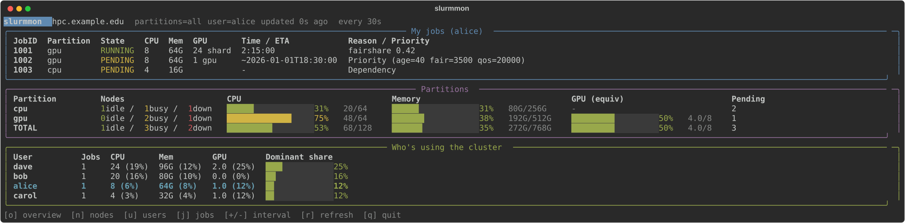

<p align="center"></p>

# slurmmon

htop for a Slurm cluster: your jobs, cluster capacity, and who's using what,
refreshed every 30s.



Two modes:

- **remote** (default) — run it anywhere, it SSHes into a Slurm login node
  for every refresh.
- **local** (`--local`) — run it directly on a machine that already has
  `sinfo`/`squeue`/etc. on PATH (e.g. the login node itself), no SSH at all.

## Install

For a plain `slurmmon` command on your PATH:

```
pip install --user .
```

If that fails with an "externally managed environment" error (common on
Homebrew/Debian Python), either use `pipx install .` instead, or fall back to
a venv:

```
python3 -m venv .venv
.venv/bin/pip install -e .   # then run .venv/bin/slurmmon
```

Either way it needs Slurm client tools (`sinfo`/`squeue`/`sprio`/`sshare`)
somewhere on PATH — on the machine you run it on for `--local`, or on the
SSH target otherwise.

## SSH setup (remote mode only)

`slurmmon` shells out to `ssh <host>` on every refresh with no password/2FA
prompt, so passwordless key auth has to already work:

```
ssh-keygen -t ed25519          # skip if you already have a key
ssh-copy-id <host>
ssh -o BatchMode=yes <host> true   # should exit silently, no prompt
```

If the real hostname, user, or a jump host differs from what you'd type by
hand, put it in `~/.ssh/config` rather than passing flags every time:

```
Host mycluster
    HostName cluster.example.edu
    User yourname
    ProxyJump bastion.example.edu
```

## Usage

```
slurmmon --host <login-node> --slurm-user <you>     # remote, over SSH
slurmmon --local                                    # local, no SSH
```

or set the env vars once (see Config) and just run `slurmmon`.

Keys: `o` overview, `n` nodes, `u` users, `j` jobs, `m` my jobs (full list --
the overview only previews your first few), arrow keys/PgUp/PgDn to scroll a
list, `[`/`]` to shrink/grow how many rows a list shows at once, `+`/`-`
interval, `r` refresh now, `q` quit.

```
slurmmon --once --json     # one snapshot as JSON, no TTY needed
```

## Config

Flags, or env vars if you'd rather set them once:

| flag                 | env var                    | default        |
|----------------------|-----------------------------|----------------|
| `--local`            | `SLURMMON_LOCAL=1`          | off            |
| `--host`             | `SLURMMON_HOST`             | (required unless `--local`) |
| `--slurm-user`       | `SLURMMON_USER`             | (required; defaults to `$USER` with `--local`) |
| `--partitions`       | `SLURMMON_PARTITIONS`       | (unset)        |
| `--partition-prefix` | `SLURMMON_PARTITION_PREFIX` | (empty = all)  |
| `--interval`         | `SLURMMON_INTERVAL`         | `30`           |

`--partitions` takes a comma-separated list of exact partition names, or
`auto` to use whatever your Slurm account is actually allowed to submit to
(checked against each partition's `AllowAccounts`/`DenyAccounts`). Leave it
unset to fall back to `--partition-prefix` matching — and leave that unset
too to just monitor every partition you can see.

## Notes

- CPU numbers are exact (Slurm hard-allocates cores). Memory is *requested*,
  not live RSS — most clusters don't expose per-job real-time usage. GPU
  shards (fractional MPS-style allocations) and whole GPUs are normalized
  onto one scale per partition, derived from each partition's node config,
  not hardcoded.
- "who's using the cluster" is ranked by max(cpu share, mem share, gpu
  share) so GPU-heavy and CPU-heavy users are comparable.
- Down/drained nodes don't count as capacity.
- All four Slurm queries run in a single call per refresh; in remote mode
  that's also a single reused SSH connection (`ControlMaster`), so polling
  stays cheap either way.

## Dev

```
.venv/bin/pip install -e ".[dev]"
.venv/bin/pytest tests/
```

Tests run against captured real Slurm output in `tests/fixtures/`, no
cluster access needed.
